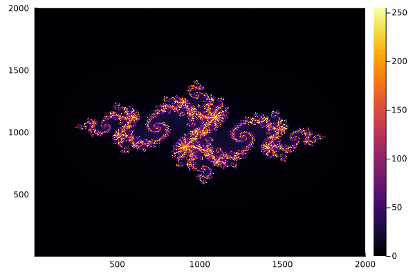

```@meta
EditURL = "juliaset.jl"
```

# Julia Set

In this example, we will compute an image of the
[Julia set](https://en.wikipedia.org/wiki/Julia_set) in parallel. We will explore
the `schedule` and `nchunks` options that can be used to get load balancing.

The value of a single pixel of the Julia set, which corresponds to a point in the
complex number plane, can be computed by the following iteration procedure.

````julia
function _compute_pixel(i, j, n; max_iter = 255, c = -0.79 + 0.15 * im)
    x = -2.0 + (j - 1) * 4.0 / (n - 1)
    y = -2.0 + (i - 1) * 4.0 / (n - 1)

    z = x + y * im
    iter = max_iter
    for k in 1:max_iter
        if abs2(z) > 4.0
            iter = k - 1
            break
        end
        z = z^2 + c
    end
    return iter
end
````

````
_compute_pixel (generic function with 1 method)
````

Note that the value of the pixel is the number of performed iterations for the
corresponding complex input number. Hence, the computational **workload is non-uniform**.

## Sequential computation

In our naive implementation, we just loop over the dimensions of the image matrix and call
the pixel kernel above.

````julia
function compute_juliaset_sequential!(img)
    N = size(img, 1)
    for j in 1:N
        for i in 1:N
            img[i, j] = _compute_pixel(i, j, N)
        end
    end
    return img
end

N = 2000
img = zeros(Int, N, N)
compute_juliaset_sequential!(img);
````

Let's look at the result

````julia
using Plots
p = heatmap(img)
````


## Parallelization

The Julia set computation above is a `map!` operation: We apply some function to each
element of the array. Hence, we can use `tmap!` for parallelization. We use
`CartesianIndices` to map between linear and two-dimensional cartesian indices.

````julia
using OhMyThreads: tmap!

function compute_juliaset_parallel!(img; kwargs...)
    N = size(img, 1)
    cart = CartesianIndices(img)
    tmap!(img, eachindex(img); kwargs...) do idx
        c = cart[idx]
        _compute_pixel(c[1], c[2], N)
    end
    return img
end

N = 2000
img = zeros(Int, N, N)
compute_juliaset_parallel!(img);
p = heatmap(img)
````


## Benchmark

Let's benchmark the variants above.

````julia
using BenchmarkTools
using Base.Threads: nthreads

N = 2000
img = zeros(Int, N, N)

@show nthreads()

@btime compute_juliaset_sequential!($img) samples=10 evals=3;
@btime compute_juliaset_parallel!($img) samples=10 evals=3;
````

````
nthreads() = 5
  138.157 ms (0 allocations: 0 bytes)
  40.373 ms (67 allocations: 6.20 KiB)

````

As hoped, the parallel implementation is much faster!

### Dynamic vs static scheduling

As stated above, the per-pixel computation is non-uniform. Hence, we do benefit from
the load balancing of the default dynamic scheduler. The latter divides the overall
workload into tasks that can then be dynamically distributed among threads to adjust the
per-thread load. We can try to fine tune and improve the load balancing further by
increasing the `nchunks` parameter of the scheduler, that is, creating more and smaller
tasks.

````julia
using OhMyThreads: DynamicScheduler

@btime compute_juliaset_parallel!($img; scheduler=DynamicScheduler(nchunks=N)) samples=10 evals=3;
````

````
  31.751 ms (12011 allocations: 1.14 MiB)

````

Note that while this turns out to be a bit faster, it comes at the expense of much more
allocations.

To quantify the impact of load balancing we can opt out of dynamic scheduling and use the
`StaticScheduler` instead. The latter doesn't provide any form of load balancing.

````julia
using OhMyThreads: StaticScheduler

@btime compute_juliaset_parallel!($img; scheduler=StaticScheduler()) samples=10 evals=3;
````

````
  63.147 ms (37 allocations: 3.26 KiB)

````

---

*This page was generated using [Literate.jl](https://github.com/fredrikekre/Literate.jl).*

